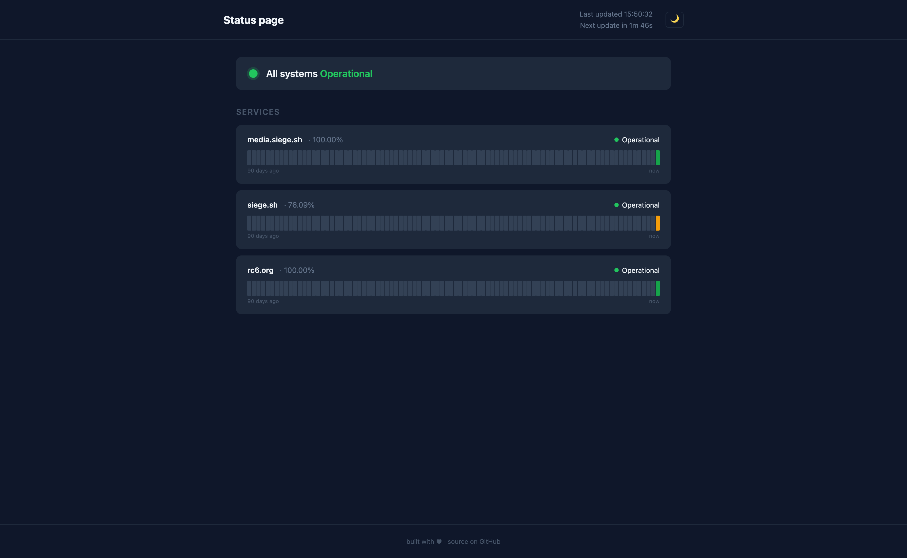
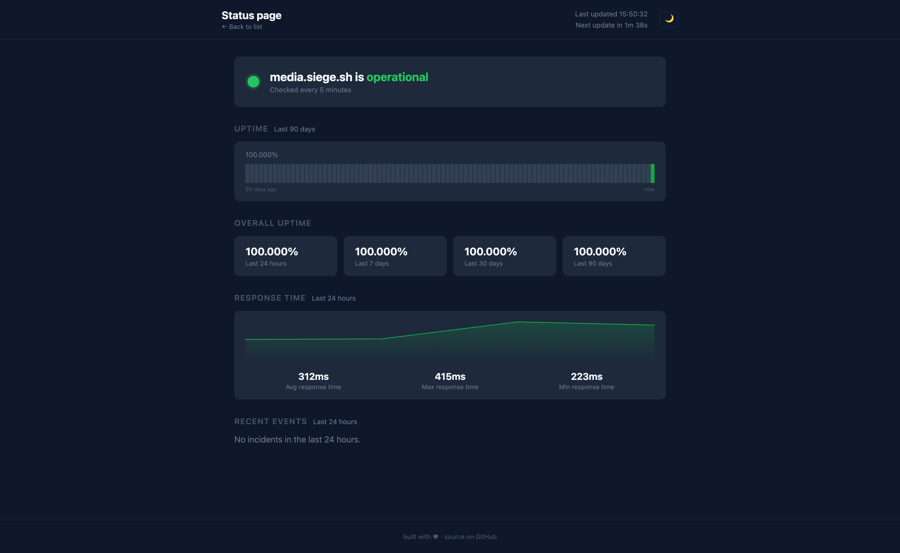

# uptime-monitor

A self-hosted uptime monitor that runs entirely on Cloudflare's free tier. It checks HTTP endpoints and TCP ports every 5 minutes and serves a live status page.




## What it does

- Checks HTTP and TCP endpoints on a 5-minute cron schedule
- Stores 90 days of history in Cloudflare KV
- Serves a status page at `/` with per-service uptime bars, a dynamic favicon, and a light/dark mode toggle
- No external services, no database, no server to manage

## Requirements

- A [Cloudflare account](https://dash.cloudflare.com/sign-up) (free tier is sufficient)
- [Wrangler CLI](https://developers.cloudflare.com/workers/wrangler/install-and-update/) installed and logged in (`wrangler login`)
- `jq` (used by the monitor management scripts)

## Cloudflare setup

If you haven't used Workers before:

1. Sign up at [dash.cloudflare.com](https://dash.cloudflare.com)
2. Install Wrangler: `npm install -g wrangler` or `brew install cloudflare-wrangler`
3. Log in: `wrangler login`

No paid plan required. The free tier includes 100,000 Worker requests/day and 1 GB of KV storage.

## Deploy

**1. Clone and bootstrap**

```bash
git clone https://github.com/nilicule/uptime-monitor
cd uptime-monitor
./bootstrap.sh
```

`bootstrap.sh` will:
- Create the KV namespace in your Cloudflare account
- Generate a local `wrangler.toml` with your namespace IDs (gitignored)
- Prompt you for your monitors config and store it as a secret

**2. Enter your monitors when prompted**

```json
[
  { "id": "mysite", "name": "My Site", "type": "http", "url": "https://example.com", "expectedStatus": [200] },
  { "id": "mynas",  "name": "NAS",     "type": "tcp",  "host": "nas.local", "port": 22 }
]
```

**3. Deploy**

```bash
wrangler deploy
```

Your status page will be live at `https://uptime-monitor.<your-subdomain>.workers.dev`.

## Managing monitors

```bash
./scripts/monitors.sh list     # Show current monitors
./scripts/monitors.sh add      # Add a monitor interactively
./scripts/monitors.sh remove   # Remove a monitor interactively
```

## License

[CC BY-NC 4.0](LICENSE) — free to use and modify, attribution required, no commercial use.

## Further reading

See [docs/reference.md](docs/reference.md) for the KV data model, API endpoints, local development setup, and troubleshooting.
